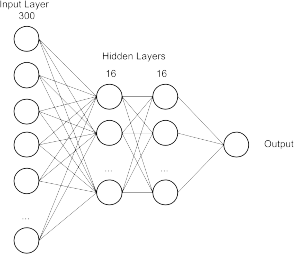
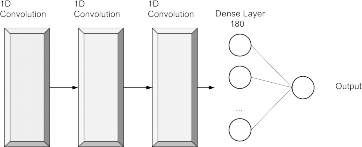
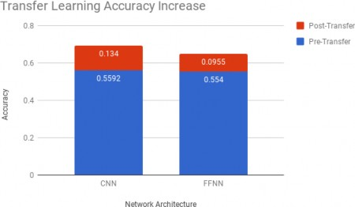
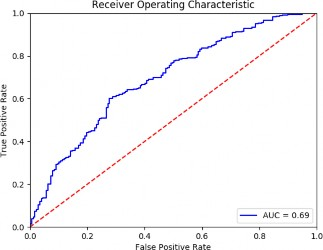
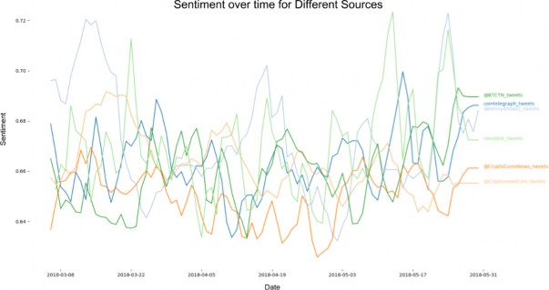

# Correlating Twitter User Sentiment and the Price of Bitcoin

# via Deep Transfer Learning

## Cedric Oeldorf

June 10, 2018

```
Abstract
This report investigates Deep Transfer Learning for the application on sentiment analysis.
Both a feed forward neural network and a convolutional neural network were utilized for the
experiment. This is followed by an investigation on whether raw sentiment correlates to the
price of Bitcoin.
```
## 1 Introduction

Machine learning algorithms have the disadvantage of assuming the training and the testing data
hold the same or identical distribution (Dai, Yang, Xue, & Yu, 2007). If it is required to use the
model on data of a different distribution, two options are available. Firstly, a new model could be
trained on entirely new data. This new data would have to be sourced and should be large enough
to help the model generalize. The section option, and thus the one we will discuss in this report,
is to apply (deep) transfer learning. The idea is simple. Transfer learning is a technique that
can circumvent the assumption of identically-distributed data by retraining the last layers of the
Network using a small, specialized data set. Transfer learning is a technique that can circumvent
the assumption of identically-distributed data without having to source a completely new data set.
The idea behind this is to first train a Neural Network on the original data set, and then retrain
the last layers of the Network using a small, specialized data set. This should fine-tune the weights
to generalize better to the new data.

We find such a problem in the application domain covered by this report. When training a
sentiment classification model on a corpus comprised of tweets, the algorithm struggles to ac-
curately predict sentiment for more specialized tweets, such as those regarding cryptocurrencies.
This comes to no surprise, as the underlying distribution between tweets regarding every day life
and those regarding markets are vastly different. Extracting sentiment from tweets itself is not a
menial task, especially considering the short length of the tweet, the common grammatical errors
and the conversational style that characterizes twitter. This brings us to our first research question
that asks whether model accuracy can be improved for a specialized tweets corpus through deep
transfer learning.

This brings us to our application. The cryptocurrency market is notorious for its low barriers
for entry. There is no minimum investment and up until recently, many exchanges did not even
request identification from customers. This results in the cryptocurrency market having a whole
different set of investors comprised more of ’normal’ people as opposed to those in for example the
stock market. This phenomenon saw a sharp spike in cryptocurrency market coverage on social
media. Both unofficial news sources and newly invested individuals are posting their opinions and
emotions regarding their new investments. Now it has been shown that the sentiment of news
media has an influence on investor psychology, and thus an influence on market trends (Tetlock,
2007). For this reason we look to Twitter for extracting not only the sentiment of news media,
but also that of traders. We hypothesize that a correlation between the average sentiment and the
price of Bitcoin is present.


## 2 Data

### 2.1 Modeling Data

The main data set and the data set used for transfer learning are outlined in Table 1.

```
Data Source Size Comment
Sentiment140 Stanford University 1,6 M Tweets Random (aged) tweets
Stock Market Tweets Nuno Oliveira 5000 Tweets Taken off Github^1
```
```
Table 1: Data Sets
```
Our main model will be trained on the Sentiment140 data set provided by Stanford University.
This corpus is a stream of random tweets without a specific topic, nor is it tracking specific users.
In other words, the corpus is not specialized for a certain domain.

### 2.2 Application Data

We extracted corpus used for our application via the Twitter API. This corpus was collected from
various cryptocurrency news accounts and day traders and will serve as the testing set for our
hypothesis regarding correlating sentiment and the Bitcoin price. Historical Bitcoin market data
was streamed from theCoinmarketcapAPI.


```
Figure 1: Sourced User Accounts
```
Figure 1 depicts 6 large accounts in terms of following. By having a large reach we assume
that the news they share has a large impact on investor psychology. Together these 6 accounts
have around 1.7 million followers. We also included a smaller source,CryptoNewsCom, as with
a smaller following maybe they share more personal sentiment as opposed to large business-like
accounts.


## 3 Methodology

This section will outline the individual elements of the pipeline used for this report. Once both


```
Figure 2: Pipeline for this Report
```
data sets are brought into a format compatible with our functions, we move onto cleaning the data
in preparation for embedding. The embedding process returned a vector of length 300 for each
tweet. These vectors were used to train the neural network in the last step. Figure 2 depicts the
pipeline as presented in the initial presentation of this report.

### 3.1 Preprocessing

In order to maximize the effectiveness of our embeddings and increase the likelihood of a successful
model several preprocessing tasks were applied to the tweets.

3.1.1 Handling Emoji

Before tokenization we first used Regex to find emoji and replace them with their respective
sentiment.
Emoji with a positive sentiment were replaced by the wordEMO_POS, whereas those with negative
sentiment were given the replacementEMO_NEG. The motivation behind this is that, especially
when it comes to market terms, the sentiment is incredibly unclear and usually brought across
by users through the use of emoji. Figure 2 depicts two examples of both positive and negative
sentiment with regards to the markets. It is clear that we would want to capture the information


```
Figure 3: Tweets
```
held within these emoji as opposed to erasing them.

3.1.2 User Mentions

Many tweets include user mentions in the form of@USER. This could be as a reply to for example
a headline, or to share an opinion about a specific user. We hypothesize that when a user include
a user name, he/she feels strong enough about something to try make themselves noticed. For this
reason we kept the user mention in the tweet by use of Regex to replace any user mention with
the wordUSER.


3.1.3 URLs

The Twitter landscape has changed a little over the years. Many tweets now share URLs together
with an opinion about what it is being shared. Once again, we hypothesize that if a URL is
accompanied by words, then this must express an opinion and could be valuable to sentiment
analysis. This we replaced anything that resembles a URL with the wordURL.

### 3.2 Embedding

In order for a machine learning algorithm to understand textual data, we have to convert the
corpus into a numerical form. We make use of two popular techniques outlined below.

3.2.1 Word2Vec

Word2Vec is a very popular word embedding technique which was developed quite recently (Mikolov,
Sutskever, Chen, Corrado, & Dean, 2013). It essentially trains a neural network with a single hid-
den layer, but instead of using the output, the hidden layer is extracted and represents the word
embedding. As it requires a lot of training data to work effectively, this report uses a pre-trained
Word2Vec embedding that has been made available by Google. The model was trained on 100
billion words and has a 300-dimensional vector for around 300 words (google, n.d.).The motivation
behind using the pre-trained net is that with our limited corpus, it would be impossible for us to
achieve the word embedding quality of the one provided by Google.

#### 3.2.2 TF-IDF

Term Frequency - Inverse Document Frequency (TF-IDF) represents the importance of a word by
adjusting the frequency of a word in a document with the frequency of the word within the entire
corpus. A high TF-IDF score implies that the word has a high importance for that document
(Ramos et al., 2003). In the next subsection we describe why we include this measure in our
pipeline.

3.2.3 Weighted Word2Vec

The final word embedding used in this report is the Word2Vec embedding multiplied by the TF-
IDF score of that word. This is motivated by the fact that tweets are very short, so certain rare
words probably carry a lot of meaning but might be drowned by the sheer number of common
words that appear. Multiplying the Word2Vec embedding with this score should further separate
certain words in the vector space, which should improve the accuracy of our model.


```
Figure 4: Compressed Embeddings of Main and Transfer Data
```
Figure 3 depicts a small sample of word embeddings after having the dimensions reduced by
TSNE. The fact that we are using weighted Word2Vec is most important for the transfer data set
that uses many jargon words that have a lot of 7meaning in terms of sentiment. And it is the
transfer set, on the right, in which we can see some separation of the sentiment classes occurring.


### 3.3 Neural Network

The effects of deep transfer learning will be showcased with two separate models. Firstly, a simple
feed forward neural network (FFNN) and secondly, a more complex convolutional network (CNN)
will be trained on the original data set and then fine-tuned through transfer learning.

3.3.1 Feed Forward Neural Network

In order to avoid over-fitting we kept the FFNN rather simple and applied the transfer learning
on the whole network as opposed to freezing layers before training.



```
Figure 5: FFNN Architecture
```
The network takes an N x 300 dimensional matrix as input, where each instance is a 300 element
long vector. After having tested different hyper-parameter combinations, the final architecture took
on the shape of 300 x 16 x 16 x 1 with regularizing dropout layers between each layer. This achieved
an accuracy of 75 percent on an unseen section of the Sentiment140 corpus. However, as expected,
it only had an accuracy of 55 percent on the specialized market corpus.

3.3.2 Convolutional Neural Network

As opposed to the FFNN, the CNN architecture is deeper and more complex. Three 1D convo-
lutional layers follow one another. These are followed by a fully connected layer and an output
layer. This combination resulted in a 73 percent accuracy on the Sentiment140 corpus, which is
surprisingly 2 percentage points lower than the performance of the FFNN. In the next step, when
applying transfer learning, it has to be decided what layers (if any) are to be frozen for training.



```
Figure 6: CNN Architecture
```
Testing multiple combinations of frozen layers it became clear that there is a trade-off between
the performance on the main corpus and that on the specialized corpus. An increase in accuracy
on one saw a decrease in accuracy on the other. Taking this into account, it became apparent that
freezing the CNN layers gave the best results. The biggest challenge, as Figure 6 depicts, is that
this fine-tuning very quickly results in over fitting.


```
Figure 7: Training Visualization
```
After only 5 epochs, the blue line, which represents the accuracy on the training set, rises very
quickly to mid-90 percent accuracy. This implies severe over-fitting. Thus we had to be very
careful during transfer learning not to let this happen. We tested our models on totally unseen
data, so any over-fitting would depict in the results.


## 4 Model Performance

Performance is reported solely on the test set that stems from the market-related tweets. This is
the accuracy that matters for our application on the cryptocurrency market.

### 4.1 Accuracy



```
Figure 8: Transfer Learning Accuracy Increase
```
Figure 8 depicts the accuracy on the testing data. The blue bars are the accuracy before transfer
learning was applied, the red bars are the increase in that accuracy after transfer learning was
completed. Although both the CNN and the FFNN have a very similar accuracy pre-transfer
learning, the CNN outperforms the FFNN by a few percentage points. This is very interesting
considering the fact that the FFNN did better on the Sentiment140 data set before transfer learning.
For this reason we will focus on the CNN for our application.

### 4.2 Receiver Operator Characteristic

The Receiver Operator Characteristic curve, or ROC curve, measures the trade-off between sen-
sitivity and specificity. Sensitivity measures the amount of positive predictions that are truly
positive, hence it is also known as the true positive rate or recall. Specificity measures the number
of negative predictions that were truly negative, also known as the true negative rate.



```
Figure 9: Transfer Learning Accuracy Increase
```
Seen in Figure 9, there seems to be a proportional trade-off between sensitivity and specificity.
If this weren’t the case, we could have maximized one of the two properties in accordance with
whichever we find more important. This can be done by adjusting the cut-off point of mapping
the predicted probability to a class, which is 0.5 by default. The area under the curve (AUC)
additionally shows the classification accuracy.

## 5 Application

For every user the sentiment over time was calculated as can be seen in Figure 10. It is interesting
to note that, although noisy, there seems to be general consensus in the sentiment trend over time.
Two major dips in sentiment can be identified around the dates of 2018-04-05 and 2018-05-03.



```
Figure 10: Sentiment of Individual Sources
```

In order to compare the sentiment to the Bitcoin price, we average the sentiment of all sources
and take a rolling mean in order to smooth the signal. The result is as follows:


```
Figure 11: Average Sentiment and Bitcoin Price
```
There is no clear visual correlation between the sentiment and the Bitcoin price. The Pearson-
Correlation-Coefficient of 0.14 confirms this.

## 6 Conclusion

Deep Transfer Learning can result in significant performance gains utilizing only a small data set
without having to fully retrain a model or source a new data set. We believe that these sentiment
prediction gains could further be increased with more topic related data.
Secondly there seems to be no clear cut correlation between the Bitcoin price and sentiment on
twitter. We believe that when combining sentiment data with other features, a good predictive
model for the Bitcoin price is possible. An additional adjustment that could be made is to use the
total cryptocurrency market capitalization as opposed to just the Bitcoin price.


## References

- (n.d.).Dai, W., Yang, Q., Xue, G.-R., & Yu, Y. (2007). Boosting for transfer learning. InProceedings of
the 24th international conference on machine learning(pp. 193–200).
- Mikolov, T., Sutskever, I., Chen, K., Corrado, G. S., & Dean, J. (2013). Distributed representations
of words and phrases and their compositionality. InAdvances in neural information processing
systems(pp. 3111–3119).
- Ramos, J., et al. (2003). Using tf-idf to determine word relevance in document queries. In
Proceedings of the first instructional conference on machine learning(Vol. 242, pp. 133–142).
- Tetlock, P. C. (2007). Giving content to investor sentiment: The role of media in the stock market.
The Journal of finance, 62 (3), 1139–1168.
